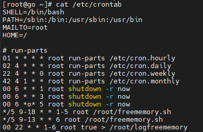
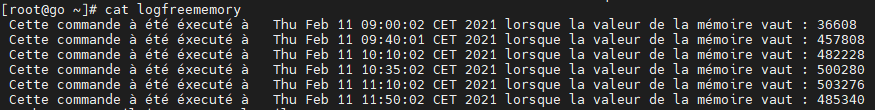

A Shell Script to Automatically Free the Physical Memory of VOIP Server in Linux.

**USAGE**

1) Creat the script & the log file

[root@go ~]# touch freememory.sh
[root@go ~]# touch logfreememory

2) Give the script the execution permision

[root@go ~]# chmod u+x freememory.sh

3) Edit the freememory.sh file and copy the script to it 

[root@go ~]# vi freememory.sh

4) Copy the the content of "Cron job" File to  this file 

[root@go ~]# vi /etc/crontab

5) to view the logfreememory file :

[root@go ~]# cat -n logfreememory

